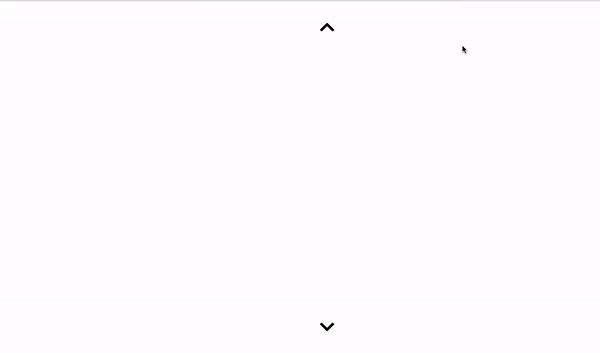

# Personal Site

This is an application created with React that will be deployed as my personal site at [ashleyklein.me](http://www.ashleyklein.me). It features animations and page-scrolling to display information in a clean and concise way.

## Security Note
Waiting for release of `react-scripts@3.3.1` which includes [https://github.com/facebook/create-react-app/pull/8079]. The most recent version, 3.3.0, uses an insecure WebSocket connection that cannot be initiated from a page loaded over HTTPS.

## Built With

JavaScript, Node.js, React, Material-UI

## Screenshots
Header and About Me:

Portfolio:

## Getting Started

To get a copy of this personal-site running on your local machine:

1. Download this project.
2. Install node modules using `npm install`.
3. Start site with `npm start` in terminal.

### Prerequisites

- Node.js
- NPM

### Completed Features

- [x] Page scrolling to navigate site.
- [x] Animation of text to time entry.

### Next Steps

- [ ] Create more dynamic backgrounds using SVGs.
- [ ] Add a navigation feature.
- [ ] Add a space to feature projects.

## Authors

* Ashley Klein
